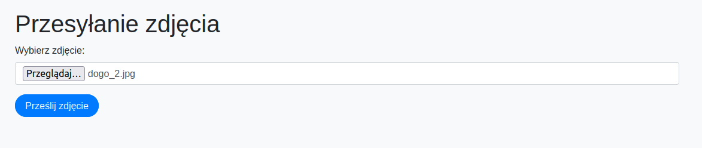

# 🐶🐱 Dog vs Cat Image Classification Web App

This is a web application that uses a **Keras-trained AI model** to classify images as either **dogs or cats**. The backend is built using **Flask**, and the user can upload photos through a simple web interface.

---

## 📸 Demo

### Web App Interface:


### Console Prediction Output:


---

## 🚀 Features

- Upload any image of a dog or cat
- Get an instant prediction via a trained AI model
- Built-in Flask web interface
- Uses a Convolutional Neural Network (CNN) trained with Keras

---

## 🧠 Model

- Framework: **Keras (TensorFlow backend)**
- Type: **CNN (Convolutional Neural Network)**
- Training Data: Custom dataset of dog and cat images
- Input image preprocessing and resizing included


---

## 🔧 Setup Instructions

### 1. Clone the repo

```bash
git clone https://github.com/your_username/dog_vs_cat_web_app.git
cd dog_vs_cat_web_app
```

### 2. Install dependencies
```bash
pip install -r requirements.txt
```

### 3. Run the app
```bash
python app.py
```

### 4. Visit in browser
```bash
http://127.0.0.1:5000
```

---

## 🛠️ Technologies Used
- Python
- Keras (TensorFlow backend)
- Flask
- HTML/CSS (Bootstrap)
